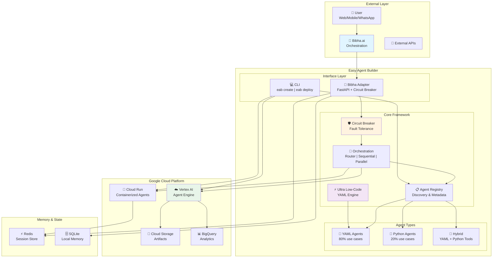
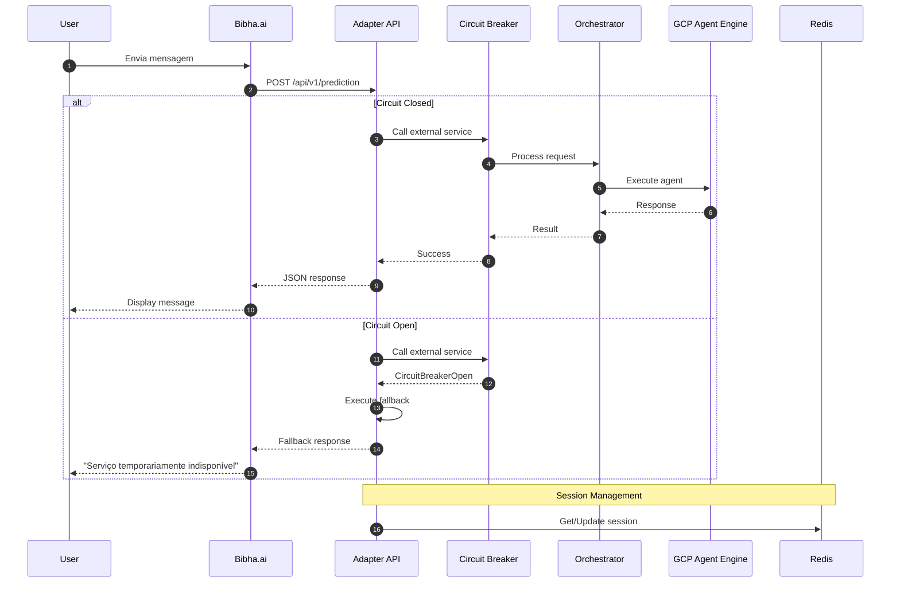

# 🏗️ Diagrama de Arquitetura - Visão Geral

## Arquitetura de Alto Nível

## Legenda

| Componente | Descrição |
|------------|-----------|
| **Bibha.ai** | Orquestração externa no-code/low-code |
| **Bibha Adapter** | API FastAPI com Circuit Breaker para integração |
| **Agent Registry** | Descoberta e metadados de agentes |
| **Orchestration** | Padrões: Router, Sequential, Parallel, Loop |
| **Ultra Low-Code** | Engine YAML com validação Pydantic |
| **Circuit Breaker** | Proteção contra falhas em cascata |
| **Vertex AI** | Deploy gerenciado na GCP |

---

## Fluxo de Requisição

