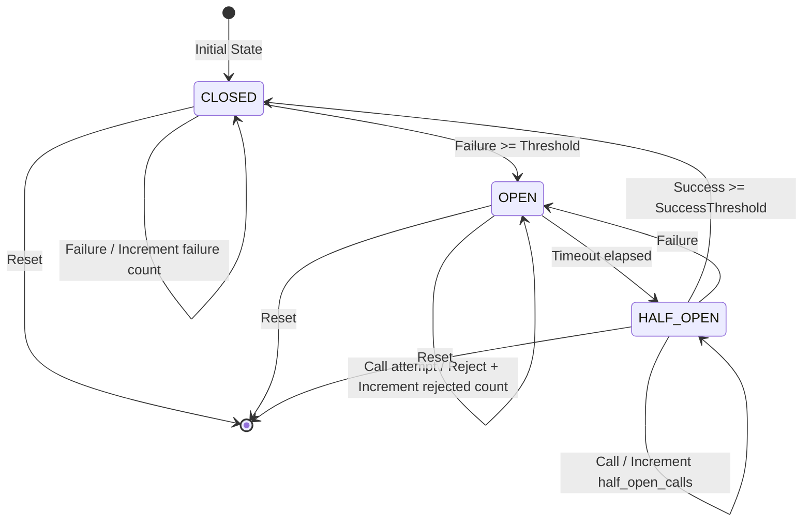
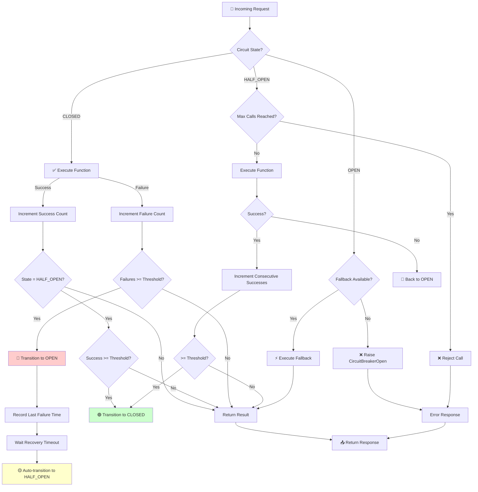
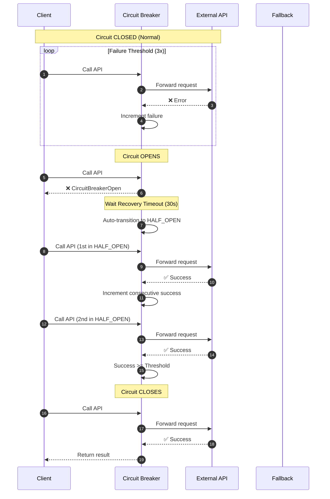
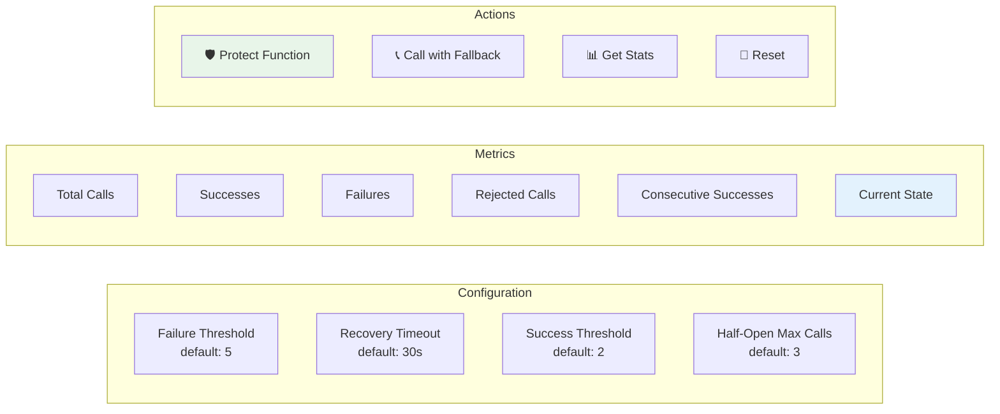

# 🛡️ Circuit Breaker - Fluxo de Estados

## Diagrama de Estados

```mermaid
stateDiagram-v2
    [*] --> CLOSED : Initial State
    
    CLOSED --> CLOSED : Success / Increment success count
    CLOSED --> CLOSED : Failure / Increment failure count
    CLOSED --> OPEN : Failure >= Threshold
    
    OPEN --> OPEN : Call attempt / Reject + Increment rejected count
    OPEN --> HALF_OPEN : Timeout elapsed
    
    HALF_OPEN --> CLOSED : Success >= SuccessThreshold
    HALF_OPEN --> OPEN : Failure
    HALF_OPEN --> HALF_OPEN : Call / Increment half_open_calls
    
    CLOSED --> [*] : Reset
    OPEN --> [*] : Reset
    HALF_OPEN --> [*] : Reset
```

## Fluxo Detalhado

```mermaid
graph TD
    A[🚀 Incoming Request] --> B{Circuit State?}
    
    B -->|CLOSED| C[✅ Execute Function]
    B -->|OPEN| D{Fallback Available?}
    B -->|HALF_OPEN| E{Max Calls Reached?}
    
    C -->|Success| F[Increment Success Count]
    C -->|Failure| G[Increment Failure Count]
    
    F --> H{State = HALF_OPEN?}
    H -->|Yes| I{Success >= Threshold?}
    H -->|No| Z[Return Result]
    I -->|Yes| J[🟢 Transition to CLOSED]
    I -->|No| Z
    
    G --> K{Failures >= Threshold?}
    K -->|Yes| L[🔴 Transition to OPEN]
    K -->|No| Z
    
    L --> M[Record Last Failure Time]
    
    D -->|Yes| N[⚡ Execute Fallback]
    D -->|No| O[❌ Raise CircuitBreakerOpen]
    
    E -->|Yes| P[❌ Reject Call]
    E -->|No| Q[Execute Function]
    Q --> R{Success?}
    R -->|Yes| S[Increment Consecutive Successes]
    R -->|No| T[🔴 Back to OPEN]
    S --> U{>= Threshold?}
    U -->|Yes| J
    U -->|No| Z
    
    M --> V[Wait Recovery Timeout]
    V --> W[🟡 Auto-transition to HALF_OPEN]
    
    N --> Z
    O --> X[Error Response]
    P --> X
    Z --> Y[📤 Return Response]
    X --> Y
    
    style L fill:#ffcccc
    style J fill:#ccffcc
    style W fill:#ffffcc
```

## Sequência de Recovery

```mermaid
sequenceDiagram
    autonumber
    participant C as Client
    participant CB as Circuit Breaker
    participant F as External API
    participant FB as Fallback

    Note over C,F: Circuit CLOSED (Normal)
    
    loop Failure Threshold (3x)
        C->>CB: Call API
        CB->>F: Forward request
        F-->>CB: ❌ Error
        CB->>CB: Increment failure
    end
    
    Note over CB: Circuit OPENS
    
    C->>CB: Call API
    CB-->>C: ❌ CircuitBreakerOpen
    
    Note over CB: Wait Recovery Timeout (30s)
    
    CB->>CB: Auto-transition to HALF_OPEN
    
    C->>CB: Call API (1st in HALF_OPEN)
    CB->>F: Forward request
    F-->>CB: ✅ Success
    CB->>CB: Increment consecutive success
    
    C->>CB: Call API (2nd in HALF_OPEN)
    CB->>F: Forward request
    F-->>CB: ✅ Success
    CB->>CB: Success >= Threshold
    
    Note over CB: Circuit CLOSES
    
    C->>CB: Call API
    CB->>F: Forward request
    F-->>CB: ✅ Success
    CB-->>C: Return result
```

## Configuração e Métricas

```mermaid
graph LR
    subgraph "Configuration"
        FT[Failure Threshold<br/>default: 5]
        RT[Recovery Timeout<br/>default: 30s]
        ST[Success Threshold<br/>default: 2]
        HM[Half-Open Max Calls<br/>default: 3]
    end
    
    subgraph "Metrics"
        T[Total Calls]
        S[Successes]
        F[Failures]
        R[Rejected Calls]
        CS[Consecutive Successes]
        STATE[Current State]
    end
    
    subgraph "Actions"
        PROTECT[🛡️ Protect Function]
        CALL[📞 Call with Fallback]
        STATS[📊 Get Stats]
        RESET[🔄 Reset]
    end

    style STATE fill:#e3f2fd
    style PROTECT fill:#e8f5e9
```
