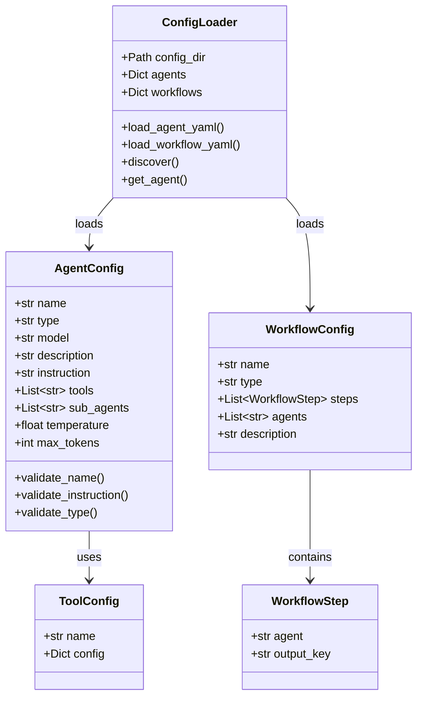
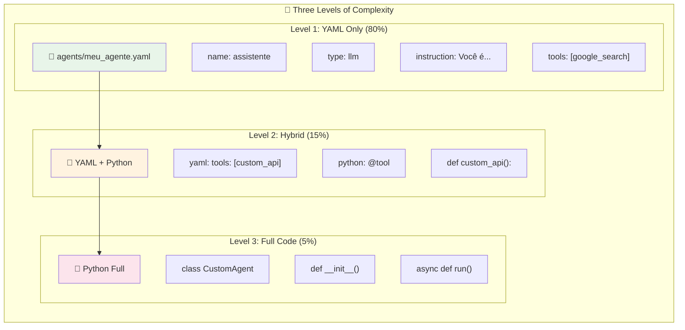
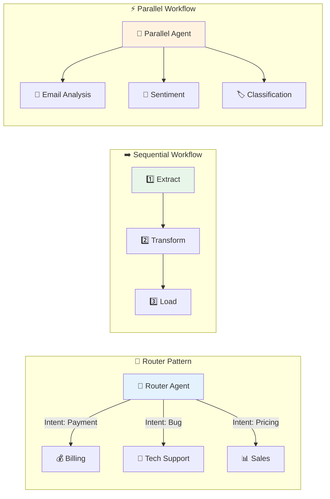
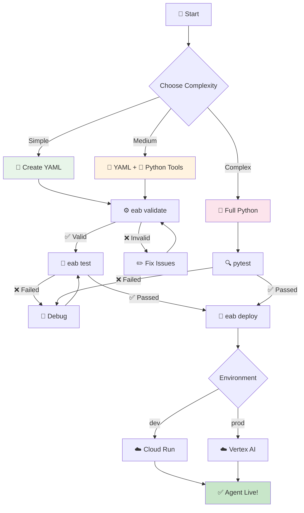

# 🤖 Hierarquia de Tipos de Agentes

## Estrutura de Agente

```mermaid
classDiagram
    class AgentConfig {
        +str name
        +str type
        +str model
        +str description
        +str instruction
        +List~str~ tools
        +List~str~ sub_agents
        +float temperature
        +int max_tokens
        +validate_name()
        +validate_instruction()
        +validate_type()
    }
    
    class WorkflowConfig {
        +str name
        +str type
        +List~WorkflowStep~ steps
        +List~str~ agents
        +str description
    }
    
    class WorkflowStep {
        +str agent
        +str output_key
    }
    
    class ToolConfig {
        +str name
        +Dict config
    }
    
    class ConfigLoader {
        +Path config_dir
        +Dict agents
        +Dict workflows
        +load_agent_yaml()
        +load_workflow_yaml()
        +discover()
        +get_agent()
    }
    
    AgentConfig --> ToolConfig : uses
    WorkflowConfig --> WorkflowStep : contains
    ConfigLoader --> AgentConfig : loads
    ConfigLoader --> WorkflowConfig : loads
```

## Tipos de Agentes

```mermaid
graph TB
    subgraph "🎨 Three Levels of Complexity"
        direction TB
        
        subgraph "Level 1: YAML Only (80%)"
            YAML["📝 agents/meu_agente.yaml"]
            Y1["name: assistente"]
            Y2["type: llm"]
            Y3["instruction: Você é..."]
            Y4["tools: [google_search]"]
        end
        
        subgraph "Level 2: Hybrid (15%)"
            HYB["🔗 YAML + Python"]
            H1["yaml: tools: [custom_api]"]
            H2["python: @tool"]
            H3["  def custom_api():"]
        end
        
        subgraph "Level 3: Full Code (5%)"
            CODE["🐍 Python Full"]
            C1["class CustomAgent"]
            C2["  def __init__()"]
            C3["  async def run()"]
        end
    end
    
    YAML --> HYB --> CODE
    
    style YAML fill:#e8f5e9
    style HYB fill:#fff3e0
    style CODE fill:#fce4ec
```

## Padrões de Orquestração

```mermaid
graph LR
    subgraph "🔀 Router Pattern"
        R["📡 Router Agent"]
        R1["💰 Billing"]
        R2["🔧 Tech Support"]
        R3["📊 Sales"]
        
        R -->|Intent: Payment| R1
        R -->|Intent: Bug| R2
        R -->|Intent: Pricing| R3
    end
    
    subgraph "➡️ Sequential Workflow"
        S1["1️⃣ Extract"]
        S2["2️⃣ Transform"]
        S3["3️⃣ Load"]
        
        S1 --> S2 --> S3
    end
    
    subgraph "⚡ Parallel Workflow"
        P["🎯 Parallel Agent"]
        P1["📧 Email Analysis"]
        P2["💬 Sentiment"]
        P3["🏷️ Classification"]
        
        P --> P1
        P --> P2
        P --> P3
    end
    
    style R fill:#e3f2fd
    style S1 fill:#e8f5e9
    style P fill:#fff3e0
```

## Fluxo de Criação de Agente

```mermaid
flowchart TD
    A[🚀 Start] --> B{Choose Complexity}
    
    B -->|Simple| C[📝 Create YAML]
    B -->|Medium| D[📝 YAML + 🐍 Python Tools]
    B -->|Complex| E[🐍 Full Python]
    
    C --> F[⚙️ eab validate]
    D --> F
    E --> G[🔍 pytest]
    
    F -->|❌ Invalid| H[✏️ Fix Issues] --> F
    F -->|✅ Valid| I[🧪 eab test]
    
    I -->|❌ Failed| J[🔧 Debug] --> I
    I -->|✅ Passed| K[🚀 eab deploy]
    
    G -->|❌ Failed| J
    G -->|✅ Passed| K
    
    K --> L{Environment}
    L -->|dev| M[☁️ Cloud Run]
    L -->|prod| N[☁️ Vertex AI]
    
    M --> O[✅ Agent Live!]
    N --> O
    
    style C fill:#e8f5e9
    style D fill:#fff3e0
    style E fill:#fce4ec
    style O fill:#c8e6c9
```
