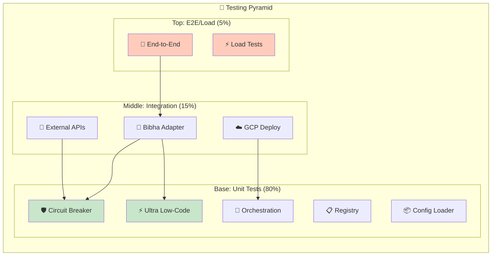
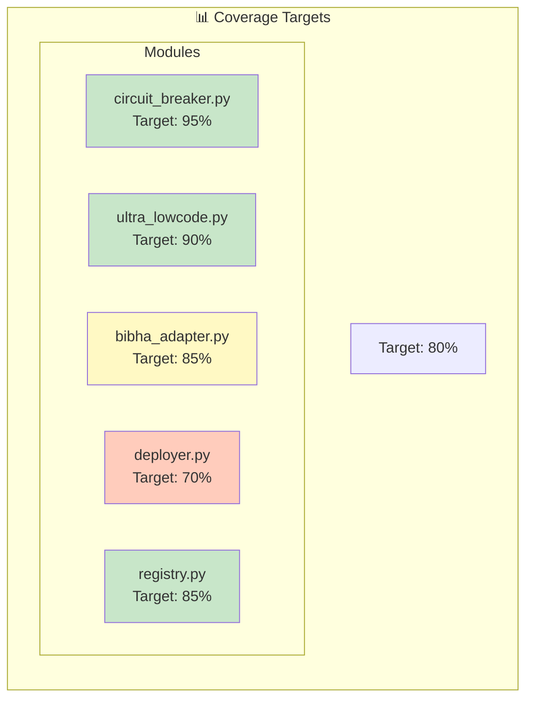
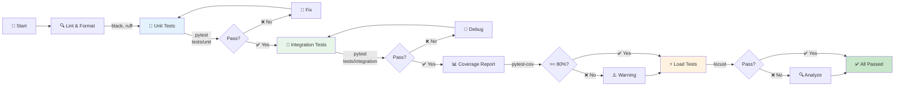
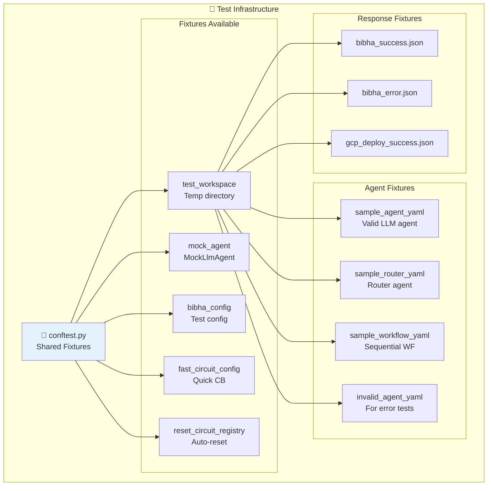
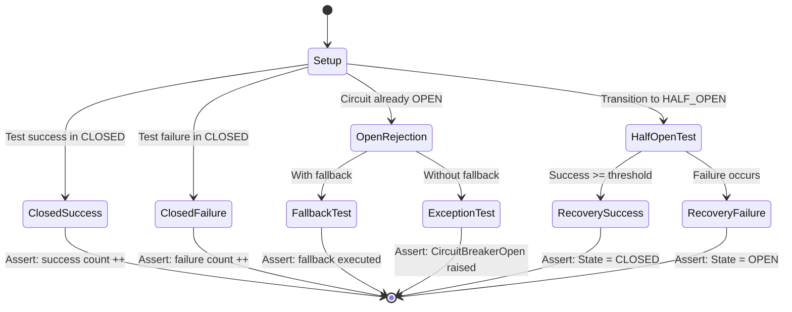
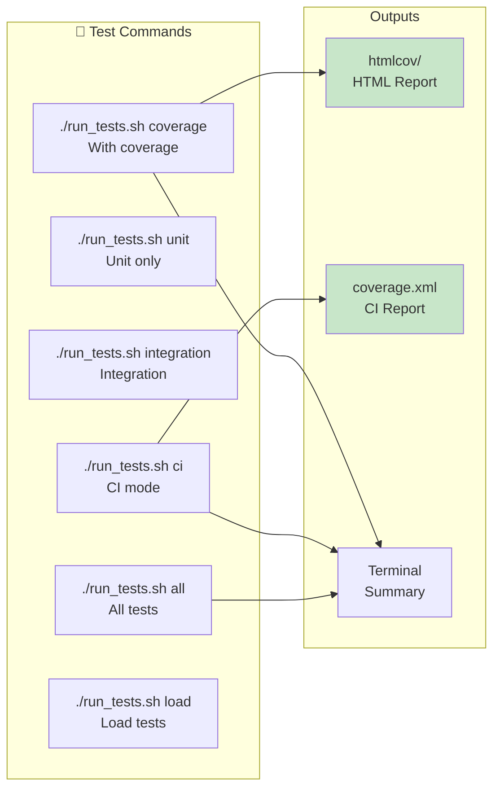

# 🧪 Pirâmide de Testes

## Estrutura de Testes

## Cobertura de Testes

## Fluxo de Execução de Testes

## Hierarquia de Fixtures

## Cenários de Teste - Circuit Breaker

## Execução de Testes por Tipo

