# 🧪 Pirâmide de Testes

## Estrutura de Testes

```mermaid
graph TD
    subgraph "🧪 Testing Pyramid"
        direction TB
        
        subgraph "Top: E2E/Load (5%)"
            LOAD["⚡ Load Tests"]
            E2E["🔗 End-to-End"]
        end
        
        subgraph "Middle: Integration (15%)"
            INT1["📡 Bibha Adapter"]
            INT2["☁️ GCP Deploy"]
            INT3["🔗 External APIs"]
        end
        
        subgraph "Base: Unit Tests (80%)"
            U1["🛡️ Circuit Breaker"]
            U2["⚡ Ultra Low-Code"]
            U3["📋 Registry"]
            U4["🔄 Orchestration"]
            U5["📦 Config Loader"]
        end
    end
    
    %% Dependencies
    E2E --> INT1
    INT1 --> U1
    INT1 --> U2
    INT2 --> U4
    INT3 --> U1
    
    style LOAD fill:#ffccbc
    style E2E fill:#ffccbc
    style U1 fill:#c8e6c9
    style U2 fill:#c8e6c9
```

## Cobertura de Testes

## Fluxo de Execução de Testes

```mermaid
flowchart LR
    A[🚀 Start] --> B[🔍 Lint & Format]
    B -->|black, ruff| C[🧪 Unit Tests]
    
    C -->|pytest<br/>tests/unit| D{Pass?}
    D -->|❌ No| E[🔧 Fix] --> C
    D -->|✅ Yes| F[🔗 Integration Tests]
    
    F -->|pytest<br/>tests/integration| G{Pass?}
    G -->|❌ No| H[🔧 Debug] --> F
    G -->|✅ Yes| I[📊 Coverage Report]
    
    I -->|pytest-cov| J{>= 80%?}
    J -->|❌ No| K[⚠️ Warning] --> L[⚡ Load Tests]
    J -->|✅ Yes| L
    
    L -->|locust| M{Pass?}
    M -->|❌ No| N[🔍 Analyze] --> O[✅ All Passed]
    M -->|✅ Yes| O
    
    style C fill:#e3f2fd
    style F fill:#e8f5e9
    style L fill:#fff3e0
    style O fill:#c8e6c9
```

## Hierarquia de Fixtures

```mermaid
graph TB
    subgraph "🔧 Test Infrastructure"
        CONF["📄 conftest.py<br/>Shared Fixtures"]
        
        subgraph "Fixtures Available"
            F1["test_workspace<br/>Temp directory"]
            F2["mock_agent<br/>MockLlmAgent"]
            F3["bibha_config<br/>Test config"]
            F4["fast_circuit_config<br/>Quick CB"]
            F5["reset_circuit_registry<br/>Auto-reset"]
        end
        
        subgraph "Agent Fixtures"
            A1["sample_agent_yaml<br/>Valid LLM agent"]
            A2["sample_router_yaml<br/>Router agent"]
            A3["sample_workflow_yaml<br/>Sequential WF"]
            A4["invalid_agent_yaml<br/>For error tests"]
        end
        
        subgraph "Response Fixtures"
            R1["bibha_success.json"]
            R2["bibha_error.json"]
            R3["gcp_deploy_success.json"]
        end
    end
    
    CONF --> F1 & F2 & F3 & F4 & F5
    F1 --> A1 & A2 & A3 & A4
    F1 --> R1 & R2 & R3
    
    style CONF fill:#e3f2fd
```

## Cenários de Teste - Circuit Breaker

## Execução de Testes por Tipo

