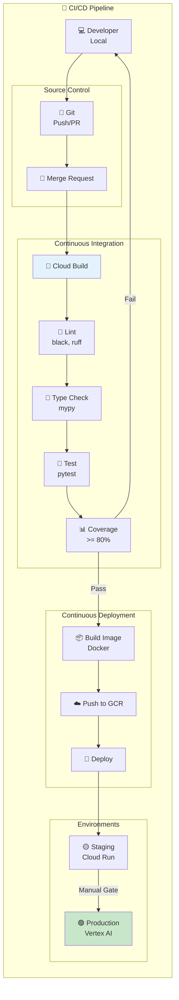
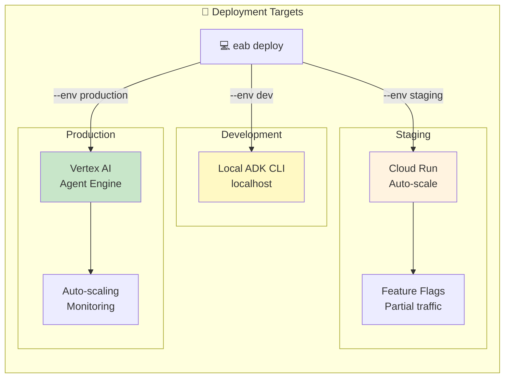
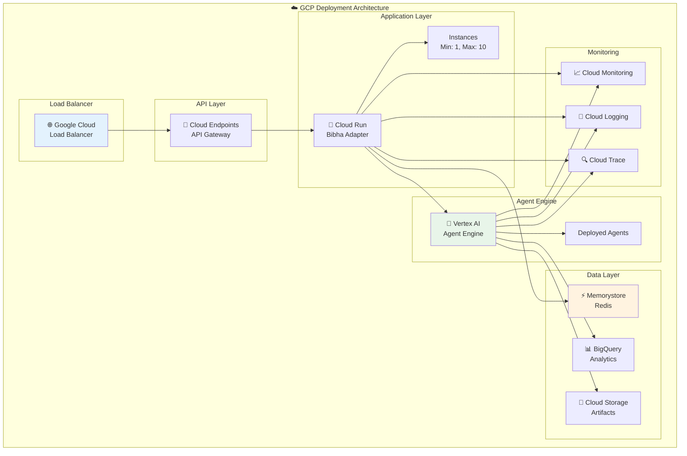
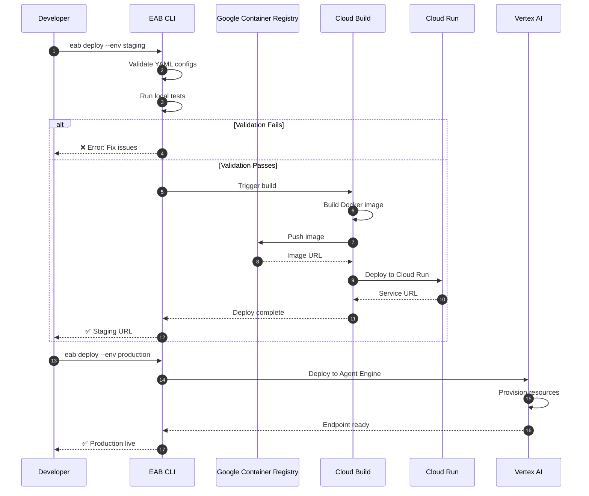
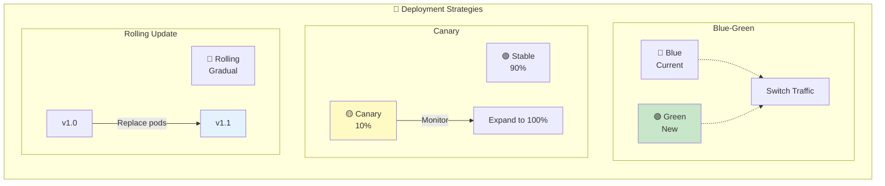
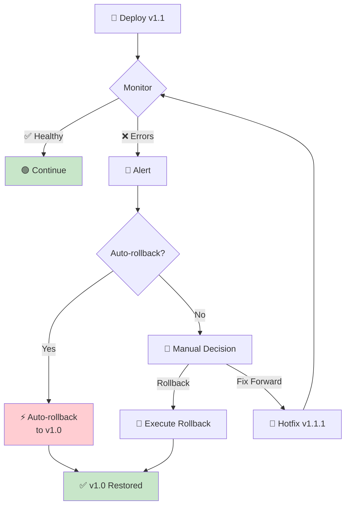

# 🚀 Pipeline de Deploy

## CI/CD Completo

```mermaid
graph LR
    subgraph "🔄 CI/CD Pipeline"
        direction TB
        
        DEV["💻 Developer<br/>Local"]
        
        subgraph "Source Control"
            GIT["🌿 Git<br/>Push/PR"]
            MR["📝 Merge Request"]
        end
        
        subgraph "Continuous Integration"
            CB["🔧 Cloud Build"]
            LINT["📏 Lint<br/>black, ruff"]
            TYPE["📘 Type Check<br/>mypy"]
            TEST["🧪 Test<br/>pytest"]
            COV["📊 Coverage<br/>>= 80%"]
        end
        
        subgraph "Continuous Deployment"
            BUILD["📦 Build Image<br/>Docker"]
            PUSH["☁️ Push to GCR"]
            DEPLOY["🚀 Deploy"]
        end
        
        subgraph "Environments"
            STAGING["🟡 Staging<br/>Cloud Run"]
            PROD["🟢 Production<br/>Vertex AI"]
        end
    end
    
    DEV --> GIT
    GIT --> MR
    MR --> CB
    CB --> LINT --> TYPE --> TEST --> COV
    COV -->|Pass| BUILD
    COV -->|Fail| DEV
    BUILD --> PUSH --> DEPLOY
    DEPLOY --> STAGING
    STAGING -->|Manual Gate| PROD

    style CB fill:#e3f2fd
    style PROD fill:#c8e6c9
```

## Deploy para Diferentes Ambientes

```mermaid
graph TB
    subgraph "🎯 Deployment Targets"
        direction TB
        
        CLI["💻 eab deploy"]
        
        subgraph "Development"
            DEV["Local ADK CLI<br/>localhost"]
        end
        
        subgraph "Staging"
            STG["Cloud Run<br/>Auto-scale"]
            STG_FEAT["Feature Flags<br/>Partial traffic"]
        end
        
        subgraph "Production"
            VERTEX["Vertex AI<br/>Agent Engine"]
            VERTEX_FEAT["Auto-scaling<br/>Monitoring"]
        end
    end
    
    CLI -->|"--env dev"| DEV
    CLI -->|"--env staging"| STG
    CLI -->|"--env production"| VERTEX
    
    STG --> STG_FEAT
    VERTEX --> VERTEX_FEAT
    
    style DEV fill:#fff9c4
    style STG fill:#fff3e0
    style VERTEX fill:#c8e6c9
```

## Arquitetura de Deploy

```mermaid
graph TB
    subgraph "☁️ GCP Deployment Architecture"
        
        subgraph "Load Balancer"
            LB["🌐 Google Cloud<br/>Load Balancer"]
        end
        
        subgraph "API Layer"
            ENDPOINTS["📍 Cloud Endpoints<br/>API Gateway"]
        end
        
        subgraph "Application Layer"
            RUN["🚀 Cloud Run<br/>Bibha Adapter"]
            RUN_INSTANCES["Instances<br/>Min: 1, Max: 10"]
        end
        
        subgraph "Agent Engine"
            VERTEX["🤖 Vertex AI<br/>Agent Engine"]
            AGENTS["Deployed Agents"]
        end
        
        subgraph "Data Layer"
            REDIS["⚡ Memorystore<br/>Redis"]
            BQ["📊 BigQuery<br/>Analytics"]
            STORAGE["💾 Cloud Storage<br/>Artifacts"]
        end
        
        subgraph "Monitoring"
            MONITOR["📈 Cloud Monitoring"]
            LOGGING["📝 Cloud Logging"]
            TRACE["🔍 Cloud Trace"]
        end
    end
    
    LB --> ENDPOINTS
    ENDPOINTS --> RUN
    RUN --> RUN_INSTANCES
    RUN --> VERTEX
    VERTEX --> AGENTS
    
    RUN --> REDIS
    VERTEX --> BQ
    VERTEX --> STORAGE
    
    RUN --> MONITOR & LOGGING & TRACE
    VERTEX --> MONITOR & LOGGING & TRACE
    
    style LB fill:#e3f2fd
    style VERTEX fill:#e8f5e9
    style REDIS fill:#fff3e0
```

## Fluxo de Deploy Passo a Passo

```mermaid
sequenceDiagram
    autonumber
    participant D as Developer
    participant CLI as EAB CLI
    participant GCR as Google Container Registry
    participant CB as Cloud Build
    participant RUN as Cloud Run
    participant VERTEX as Vertex AI

    D->>CLI: eab deploy --env staging
    
    CLI->>CLI: Validate YAML configs
    CLI->>CLI: Run local tests
    
    alt Validation Fails
        CLI-->>D: ❌ Error: Fix issues
    else Validation Passes
        CLI->>CB: Trigger build
        
        CB->>CB: Build Docker image
        CB->>GCR: Push image
        GCR-->>CB: Image URL
        
        CB->>RUN: Deploy to Cloud Run
        RUN-->>CB: Service URL
        
        CB-->>CLI: Deploy complete
        CLI-->>D: ✅ Staging URL
    end
    
    D->>CLI: eab deploy --env production
    
    CLI->>VERTEX: Deploy to Agent Engine
    VERTEX->>VERTEX: Provision resources
    VERTEX-->>CLI: Endpoint ready
    
    CLI-->>D: ✅ Production live
```

## Estratégias de Deploy

```mermaid
graph LR
    subgraph "🔄 Deployment Strategies"
        
        subgraph "Blue-Green"
            BG1["🔵 Blue<br/>Current"]
            BG2["🟢 Green<br/>New"]
            BG_SW["Switch Traffic"]
            
            BG1 -.-> BG_SW
            BG2 -.-> BG_SW
        end
        
        subgraph "Canary"
            CAN1["🟢 Stable<br/>90%"]
            CAN2["🟡 Canary<br/>10%"]
            
            CAN2 -->|Monitor| CAN_EXPAND["Expand to 100%"]
        end
        
        subgraph "Rolling Update"
            ROLL["🔄 Rolling<br/>Gradual"]
            R1["v1.0"]
            R2["v1.1"]
            
            R1 -->|Replace pods| R2
        end
    end
    
    style BG2 fill:#c8e6c9
    style CAN2 fill:#fff9c4
    style R2 fill:#e3f2fd
```

## Rollback Strategy

```mermaid
flowchart TD
    A[🚀 Deploy v1.1] --> B{Monitor}
    
    B -->|✅ Healthy| C[🟢 Continue]
    B -->|❌ Errors| D[🔴 Alert]
    
    D --> E{Auto-rollback?}
    E -->|Yes| F[⚡ Auto-rollback<br/>to v1.0]
    E -->|No| G[🚨 Manual Decision]
    
    G -->|Rollback| H[🔄 Execute Rollback]
    G -->|Fix Forward| I[🔧 Hotfix v1.1.1]
    
    F --> J[✅ v1.0 Restored]
    H --> J
    I --> B
    
    style C fill:#c8e6c9
    style F fill:#ffcdd2
    style J fill:#c8e6c9
```
