# 🔌 Integração Bibha.ai - Detalhamento

## Fluxo de Dados Completo

```mermaid
graph TB
    subgraph "👤 User Channel"
        USER["User"]
        WHATSAPP["📱 WhatsApp"]
        WEB["🌐 Web Chat"]
        VOICE["📞 Voice"]
    end
    
    subgraph "Bibha.ai Platform"
        BIBHA["🤖 Bibha.ai<br/>Orchestration"]
        INTENT["🎯 Intent Classifier"]
        BIBHA_AGENTS["📦 Native Agents"]
    end
    
    subgraph "Easy Agent Builder"
        ADAPTER["📡 Bibha Adapter<br/>FastAPI"]
        CB["🛡️ Circuit Breaker"]
        SESSION["💾 Session Store<br/>Redis/SQLite"]
        AGENTS["🤖 ADK Agents"]
    end
    
    subgraph "Tools & APIs"
        SEARCH["🔍 Google Search"]
        CRM["📇 CRM API"]
        DB["🗄️ Database"]
    end
    
    USER --> WHATSAPP & WEB & VOICE
    WHATSAPP & WEB & VOICE --> BIBHA
    BIBHA --> INTENT
    
    INTENT -->|Simple Query| BIBHA_AGENTS
    INTENT -->|Complex Task| ADAPTER
    
    ADAPTER --> CB
    CB -->|Success| AGENTS
    CB -->|Failure| ADAPTER
    
    ADAPTER <-->|Session Data| SESSION
    AGENTS --> SEARCH & CRM & DB
    
    AGENTS -->|Response| ADAPTER
    ADAPTER -->|JSON| BIBHA
    BIBHA --> USER
    
    style ADAPTER fill:#e3f2fd
    style CB fill:#fff3e0
    style SESSION fill:#e8f5e9
```



## Formato de Mensagens

```mermaid
graph LR
    subgraph "Bibha → Adapter"
        B_REQ["```json
{
  'question': '...',
  'sessionId': '...',
  'chatflowId': '...',
  'metadata': {...}
}
```"]
    end
    
    subgraph "Adapter → ADK"
        A_PROC["```
1. Parse request
2. Get/Create session
3. Build context
4. Run agent
```"]
    end
    
    subgraph "Adapter → Bibha"
        B_RES["```json
{
  'text': '...',
  'sessionId': '...',
  'chatflowId': '...',
  'source': 'adk_agent'
}
```"]
    end
    
    B_REQ --> A_PROC --> B_RES
```

## Endpoints da API

```mermaid
graph TB
    subgraph "📡 Bibha Adapter API"
        
        subgraph "Prediction"
            P["POST /api/v1/prediction/{chatflowId}"]
            P_REQ["Request: BibhaIncomingRequest"]
            P_RES["Response: BibhaResponse"]
        end
        
        subgraph "Webhook"
            W["POST /webhook/bibha"]
            W_ALT["Alternative endpoint"]
        end
        
        subgraph "Health & Metrics"
            H["GET /health"]
            M["GET /metrics/circuit-breakers"]
        end
        
        subgraph "Session Management"
            S_GET["GET /session/{sessionId}"]
            S_DEL["DELETE /session/{sessionId}"]
        end
    end
    
    P --> P_REQ --> P_RES
    W --> W_ALT
    H --> M
    S_GET --> S_DEL
    
    style P fill:#e3f2fd
    style H fill:#e8f5e9
```



## Gerenciamento de Sessão

```mermaid
sequenceDiagram
    autonumber
    participant U as User
    participant B as Bibha.ai
    participant A as Adapter
    participant S as Session Store
    participant ADK as ADK Agent

    Note over U,ADK: First Message
    
    U->>B: "Olá, preciso de ajuda"
    B->>A: POST /prediction<br/>{sessionId: "new-session-001"}
    
    A->>S: Get session "new-session-001"
    S-->>A: Not found (new session)
    A->>A: Create new session
    A->>ADK: Run agent with context
    ADK-->>A: Response + session update
    A->>S: Store updated session
    A-->>B: {text: "Olá! Como posso ajudar?"}
    B-->>U: Display response

    Note over U,ADK: Follow-up Message
    
    U->>B: "Quero saber mais sobre planos"
    B->>A: POST /prediction<br/>{sessionId: "new-session-001"}
    
    A->>S: Get session "new-session-001"
    S-->>A: Session with history
    A->>A: Build context with history
    A->>ADK: Run with full context
    ADK-->>A: Context-aware response
    A->>S: Update session
    A-->>B: {text: "Temos os planos Basic..."}
    B-->>U: Display response
```



## Circuit Breaker na Integração

```mermaid
graph TB
    subgraph "🛡️ Circuit Breaker Protection"
        A["📡 Adapter"]
        
        subgraph "Circuit States"
            C_CLOSED["🟢 CLOSED<br/>Normal operation"]
            C_OPEN["🔴 OPEN<br/>Rejecting requests"]
            C_HALF["🟡 HALF_OPEN<br/>Testing recovery"]
        end
        
        subgraph "Actions"
            FORWARD["➡️ Forward to ADK"]
            FALLBACK["⚡ Return fallback"]
            STORE["💾 Store in queue<br/>for retry"]
        end
    end
    
    A --> C_CLOSED
    C_CLOSED -->|Success| FORWARD
    C_CLOSED -->|Failure x3| C_OPEN
    
    C_OPEN -->|After timeout| C_HALF
    C_OPEN -->|Request| FALLBACK
    
    C_HALF -->|Success| C_CLOSED
    C_HALF -->|Failure| C_OPEN
    
    style C_CLOSED fill:#c8e6c9
    style C_OPEN fill:#ffcdd2
    style C_HALF fill:#fff9c4
```



## Configuração do HTTP Tool (Bibha)

```mermaid
graph LR
    subgraph "🔧 Bibha HTTP Tool Config"
        
        CONFIG["```yaml
Name: ADK Agent Integration
Method: POST
URL: https://adapter-url.run.app
       /api/v1/prediction/{chatflowId}
Headers:
  Content-Type: application/json
  X-API-Key: {{api_key}}
Body:
  question: {{user_message}}
  sessionId: {{session_id}}
  chatflowId: {{chatflow_id}}
  metadata:
    channel: {{channel}}
    user_id: {{user_id}}
```"]
    end
    
    subgraph "Response Mapping"
        MAP["```
Text: {{response.text}}
Session: {{response.sessionId}}
Source: ADK Agent
```"]
    end
    
    CONFIG --> MAP
```

## Error Handling Flow

```mermaid
flowchart TD
    A[📨 Request from Bibha] --> B{Parse Valid?}
    
    B -->|❌ Invalid| C[🔴 400 Bad Request]
    B -->|✅ Valid| D{Session Exists?}
    
    D -->|No| E[🆕 Create Session]
    D -->|Yes| F[📂 Load Session]
    
    E & F --> G{Circuit State?}
    
    G -->|🔴 OPEN| H[⚡ Execute Fallback]
    G -->|🟢 CLOSED| I[🤖 Run ADK Agent]
    
    I --> J{Agent Success?}
    
    J -->|✅ Yes| K[💾 Update Session]
    J -->|❌ No| L{Retry?}
    
    L -->|Yes| I
    L -->|No| M[🔴 Return Error]
    
    H --> N[📤 Return Response]
    K --> N
    M --> N
    C --> N
    
    N --> O[📨 Response to Bibha]
    
    style C fill:#ffcdd2
    style H fill:#fff3e0
    style M fill:#ffcdd2
    style O fill:#c8e6c9
```


