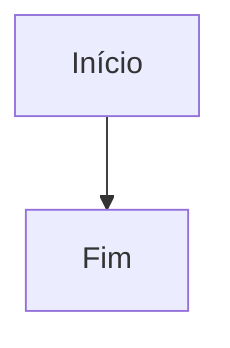

# 📊 Diagramas - Easy Agent Builder

> **Ready-to-ship** diagrams for architecture, flow, and deployment documentation.

## 📁 Índice de Diagramas

| # | Diagrama | Descrição | File |
|---|----------|-----------|------|
| 1 | [🏗️ Visão Geral da Arquitetura](01-architecture-overview.md) | Arquitetura de alto nível e fluxo de requisição | `01-architecture-overview.md` |
| 2 | [🛡️ Circuit Breaker](02-circuit-breaker-flow.md) | Estados, fluxos e recovery do circuit breaker | `02-circuit-breaker-flow.md` |
| 3 | [🤖 Hierarquia de Agentes](03-agent-types-hierarchy.md) | Tipos de agentes e padrões de orquestração | `03-agent-types-hierarchy.md` |
| 4 | [🧪 Pirâmide de Testes](04-testing-pyramid.md) | Estrutura de testes e fixtures | `04-testing-pyramid.md` |
| 5 | [🚀 Pipeline de Deploy](05-deployment-pipeline.md) | CI/CD e estratégias de deploy | `05-deployment-pipeline.md` |
| 6 | [🔌 Integração Bibha.ai](06-bibha-integration-detail.md) | Fluxo de dados e gerenciamento de sessão | `06-bibha-integration-detail.md` |

---

## 🎯 Como Usar

### Visualização

Os diagramas são escritos em **Mermaid** e podem ser visualizados em:

1. **GitHub/GitLab** - Renderização nativa
2. **VS Code** - Extensão "Markdown Preview Mermaid Support"
3. **Mermaid Live Editor** - https://mermaid.live
4. **MkDocs** - Com plugin `mkdocs-mermaid2-plugin`

### Exportação para Imagem

Para exportar como PNG/SVG/PDF:

```bash
# Usando Mermaid CLI
npm install -g @mermaid-js/mermaid-cli

# Exportar diagrama específico
mmdc -i 01-architecture-overview.md -o architecture.png

# Exportar todos
for file in *.md; do
    mmdc -i "$file" -o "exports/${file%.md}.png"
done
```

### Inserção em Documentação

```markdown
## Arquitetura


Ou diretamente como código Mermaid:


```

---

## 🎨 Convenções de Cores

| Cor | Significado | Hex |
|-----|-------------|-----|
| 🟢 Verde claro | Sucesso, healthy, closed | `#c8e6c9` |
| 🔴 Vermelho claro | Erro, open, failure | `#ffcdd2` |
| 🟡 Amarelo claro | Warning, half-open | `#fff9c4` |
| 🔵 Azul claro | Info, adapter, API | `#e3f2fd` |
| 🟠 Laranja | Processamento, hybrid | `#fff3e0` |
| 🟣 Roxo claro | YAML, ultra low-code | `#f3e5f5` |
| ⚪ Cinza claro | Default, neutral | `#f5f5f5` |

---

## 🔄 Atualização

Para adicionar novos diagramas:

1. Crie arquivo `XX-nome-descritivo.md`
2. Adicione cabeçalho com título e descrição
3. Use diagramas Mermaid
4. Atualize este README
5. Exporte para `exports/` se necessário

---

## 📚 Recursos Adicionais

- [Mermaid Documentation](https://mermaid.js.org/)
- [Mermaid Live Editor](https://mermaid.live)
- [Markdown Guide](https://www.markdownguide.org/)

---

<p align="center">
  <strong>Easy Agent Builder</strong> - Build and deploy AI agents in minutes, not weeks.
</p>
