# 📚 Complete User Guide

> Everything you need to know about Easy Agent Builder

---

## 📖 Table of Contents

1. [Introduction](#introduction)
2. [Architecture Overview](#architecture-overview)
3. [Three Levels of Complexity](#three-levels-of-complexity)
4. [Creating Agents](#creating-agents)
5. [Orchestration Patterns](#orchestration-patterns)
6. [Tools & Integrations](#tools--integrations)
7. [Testing & Debugging](#testing--debugging)
8. [Deployment](#deployment)
9. [Monitoring & Observability](#monitoring--observability)
10. [Best Practices](#best-practices)

---

## Introduction

### What is Easy Agent Builder?

Easy Agent Builder is a **low-code framework** for building and deploying AI agents on Google Cloud Platform using Google's Agent Development Kit (ADK).

### Key Features

| Feature | Description |
|---------|-------------|
| **Ultra Low-Code** | Create agents with YAML only |
| **Hybrid Approach** | YAML + Python when needed |
| **Fault Tolerance** | Built-in circuit breaker pattern |
| **Multi-Platform** | Deploy to Cloud Run or Vertex AI |
| **External Integration** | Ready for Bibha.ai and other platforms |
| **Production Ready** | CI/CD, monitoring, and observability built-in |

---

## Architecture Overview

```mermaid
graph TB
    subgraph "External Layer"
        BIBHA["🤖 Bibha.ai<br/>Orchestration"]
        API["🔌 REST API"]
        CLI["💻 CLI"]
    end

    subgraph "Easy Agent Builder"
        direction TB
        
        subgraph "Interface"
            ADAPTER["📡 Bibha Adapter<br/>FastAPI + Circuit Breaker"]
            CMD["⚡ CLI<br/>Command Line"]
        end
        
        subgraph "Core Engine"
            REG["📋 Registry<br/>Agent Discovery"]
            ORCH["🔄 Orchestration<br/>Workflow Patterns"]
            ULTRA["⚡ Ultra Low-Code<br/>YAML Engine"]
            CB["🛡️ Circuit Breaker<br/>Fault Tolerance"]
        end
        
        subgraph "Agent Layer"
            YAML_AGENTS["📝 YAML Agents"]
            PY_AGENTS["🐍 Python Agents"]
        end
    end

    subgraph "Google Cloud"
        VERTEX["☁️ Vertex AI<br/>Agent Engine"]
        RUN["🚀 Cloud Run"]
    end

    BIBHA --> ADAPTER
    API --> ADAPTER
    CLI --> CMD
    
    ADAPTER --> CB --> ORCH --> REG
    REG --> YAML_AGENTS & PY_AGENTS
    
    ORCH --> VERTEX & RUN
```



---

## Three Levels of Complexity

### Level 1: YAML Only (80% of use cases)

For simple agents, use YAML configuration only:

```yaml
# agents/simple_assistant.yaml
name: simple_assistant
type: llm
model: gemini-2.0-flash-exp

description: A simple helpful assistant

instruction: |
  You are a helpful assistant. Answer user questions
  clearly and concisely. Always be polite.

tools:
  - google_search

temperature: 0.7
max_tokens: 2048
```

**Time:** 5 minutes  
**Code:** 0 lines of Python

---

### Level 2: Hybrid (15% of use cases)

For agents needing custom tools, combine YAML + Python:

**YAML Configuration:**
```yaml
# agents/hybrid_agent.yaml
name: crm_agent
type: llm
instruction: Help users with CRM queries
tools:
  - google_search
  - query_crm  # Custom Python tool
```

**Python Tool:**
```python
# src/tools/crm.py
from google.adk.tools import tool
import httpx

@tool
def query_crm(customer_id: str) -> dict:
    """Query customer information from CRM."""
    response = httpx.get(
        f"https://api.company.com/crm/{customer_id}",
        headers={"Authorization": "Bearer token"}
    )
    return response.json()
```

**Time:** 15 minutes  
**Use case:** Custom integrations

---

### Level 3: Full Code (5% of use cases)

For complex workflows, use full Python:

```python
# src/agents/custom/agent.py
from google.adk.agents import LlmAgent, SequentialAgent
from google.adk.tools import google_search

# Custom processing agent
processor = LlmAgent(
    model="gemini-2.0-flash-exp",
    name="processor",
    instruction="Process and analyze data"
)

# Validator agent
validator = LlmAgent(
    model="gemini-2.0-flash-exp",
    name="validator",
    instruction="Validate outputs"
)

# Workflow
workflow = SequentialAgent(
    name="processing_pipeline",
    sub_agents=[processor, validator]
)
```

**Time:** 30-60 minutes  
**Use case:** Complex business logic

---

## Creating Agents

### Agent Configuration Schema

```yaml
name: string              # Unique agent name (required)
type: string              # llm | router | sequential | parallel | loop
model: string             # gemini-2.0-flash-exp (default)
description: string       # Brief description
instruction: string       # System prompt (required)
tools: list               # List of tool names
sub_agents: list          # For router/sequential/parallel

temperature: float        # 0.0 - 1.0 (default: 0.7)
max_tokens: int           # Max response tokens (default: 2048)
top_p: float              # Nucleus sampling
top_k: int                # Top-k sampling
```

### Validation Rules

| Field | Rule | Error |
|-------|------|-------|
| `name` | Min 2 chars, alphanumeric + `_-` | "name must be at least 2 characters" |
| `instruction` | Min 10 characters | "instruction too short" |
| `type` | Must be valid enum | "type must be one of: llm, router, sequential, parallel, loop" |

---

## Orchestration Patterns

### 1. Router Pattern

Distributes requests to specialist agents based on intent:

```mermaid
graph LR
    USER["User"] --> ROUTER["🎯 Router"]
    ROUTER -->|Billing| A["💰 Finance"]
    ROUTER -->|Technical| B["🔧 Support"]
    ROUTER -->|Sales| C["📈 Sales"]
```



```yaml
name: support_router
type: router
instruction: Route to appropriate specialist
sub_agents:
  - finance_agent
  - support_agent
  - sales_agent
```

---

### 2. Sequential Workflow

Executes agents in sequence, passing context:

```mermaid
graph LR
    A["1️⃣ Extract"] --> B["2️⃣ Transform"]
    B --> C["3️⃣ Load"]
```



```yaml
name: etl_pipeline
type: sequential
steps:
  - agent: extractor
    output_key: extracted_data
  - agent: transformer
    output_key: transformed_data
  - agent: loader
    output_key: loaded_data
```

---

### 3. Parallel Workflow

Executes agents concurrently:

```mermaid
graph TB
    P["⚡ Parallel Agent"]
    P --> A["📧 Email"]
    P --> B["💬 Sentiment"]
    P --> C["🏷️ Classify"]
```



```yaml
name: analysis_parallel
type: parallel
agents:
  - email_analyzer
  - sentiment_analyzer
  - classifier
```

---

### 4. Loop Pattern

Iterates until condition met:

```yaml
name: quality_checker
type: loop
max_iterations: 5
condition: quality_score >= 0.9
sub_agent: reviewer
```

---

## Tools & Integrations

### Built-in Tools

| Tool | Description | Use Case |
|------|-------------|----------|
| `google_search` | Web search | Current information |
| `vertex_search` | Enterprise search | RAG applications |
| `bigquery` | Data warehouse | Analytics queries |
| `code_execution` | Python execution | Data processing |

### Creating Custom Tools

```python
from google.adk.tools import tool
from pydantic import BaseModel

class WeatherInput(BaseModel):
    location: str
    unit: str = "celsius"

@tool
def get_weather(input: WeatherInput) -> dict:
    """Get weather for a location."""
    # Implementation
    return {
        "temperature": 22,
        "condition": "sunny",
        "location": input.location
    }
```

---

## Testing & Debugging

### Unit Tests

```bash
# Run all unit tests
./run_tests.sh unit

# Run specific test
pytest tests/unit/test_circuit_breaker.py -v

# With coverage
pytest tests/unit --cov=agent_builder --cov-report=html
```

### Integration Tests

```bash
# Run integration tests (requires API keys)
./run_tests.sh integration

# Mock mode (no API keys needed)
pytest tests/integration -v --mock
```

### Load Testing

```bash
# Start Locust
./run_tests.sh load

# Or run headless
locust -f tests/load/test_adapter_load.py \
       --host=http://localhost:8080 \
       --users 100 --spawn-rate 10 \
       --run-time 5m --headless
```

### Debugging

```bash
# Run agent with debug logging
LOG_LEVEL=DEBUG eab run agents/my_agent.yaml

# Check circuit breaker status
curl http://localhost:8080/metrics/circuit-breakers

# View logs
eab logs my_agent --follow
```

---

## Deployment

### Environment Overview

```mermaid
graph LR
    DEV["💻 Dev<br/>Local"] --> STG["🟡 Staging<br/>Cloud Run"]
    STG --> PRD["🟢 Production<br/>Vertex AI"]
```



### Deployment Commands

```bash
# Deploy to staging
eab deploy --env staging --agent my_agent

# Deploy to production
eab deploy --env production --agent my_agent

# Deploy all agents
eab deploy --env production --all

# Rollback
eab rollback --env production --agent my_agent --version v1.0.0
```

### CI/CD Pipeline

```yaml
# .cloudbuild.yaml
steps:
  # 1. Lint
  - name: 'python:3.11'
    args: ['ruff', 'check', 'src/']
  
  # 2. Test
  - name: 'python:3.11'
    args: ['pytest', 'tests/', '--cov=agent_builder']
  
  # 3. Build
  - name: 'gcr.io/cloud-builders/docker'
    args: ['build', '-t', 'gcr.io/$PROJECT_ID/agent:$SHORT_SHA', '.']
  
  # 4. Deploy
  - name: 'gcr.io/google.com/cloudsdktool/cloud-sdk'
    args: ['gcloud', 'ai', 'agent-engines', 'deploy', ...]
```

---

## Monitoring & Observability

### Health Checks

```bash
# Health endpoint
curl http://localhost:8080/health

# Response:
{
  "status": "healthy",
  "circuit_breaker": {
    "state": "closed",
    "failures": 0,
    "rejected_calls": 0
  }
}
```

### Metrics

| Metric | Description | Alert Threshold |
|--------|-------------|-----------------|
| `request_latency` | Response time | > 2s |
| `error_rate` | Failed requests | > 5% |
| `circuit_state` | Circuit breaker state | OPEN |
| `token_usage` | LLM tokens consumed | > 10k/min |

### Logging

```python
import logging

logger = logging.getLogger(__name__)

# Structured logging
logger.info("Agent execution", extra={
    "agent_name": "my_agent",
    "session_id": "sess-123",
    "latency_ms": 1250
})
```

---

## Best Practices

### Agent Design

1. **Start Simple**
   - Begin with YAML-only agents
   - Add complexity only when needed

2. **Clear Instructions**
   - Be specific in agent instructions
   - Include examples in prompts

3. **Tool Selection**
   - Use minimal necessary tools
   - Document tool behavior

4. **Error Handling**
   - Always have fallbacks
   - Use circuit breakers for external calls

### Security

```yaml
# Use environment variables for secrets
# NEVER hardcode credentials

api_key: ${API_KEY}  # ✅ Good
api_key: "sk-123..."  # ❌ Bad
```

### Performance

- Use `temperature: 0.3` for deterministic tasks
- Set appropriate `max_tokens` to control costs
- Enable caching for repeated queries

### Testing

- Test agents with real user queries
- Use load testing before production
- Monitor error rates continuously

---

## Troubleshooting

### Common Issues

| Issue | Solution |
|-------|----------|
| Agent not responding | Check circuit breaker status |
| High latency | Enable caching, reduce tools |
| Out of memory | Reduce `max_tokens` |
| Deployment fails | Check GCP permissions |

### Debug Commands

```bash
# Check agent config
eab validate agents/my_agent.yaml --verbose

# Test locally
eab test my_agent --interactive

# View recent logs
eab logs my_agent --tail=100
```

---

## Next Steps

- [YAML Reference](03-yaml-reference.md) - Complete configuration options
- [Python API](04-python-api.md) - Full code documentation
- [Architecture Diagrams](../diagrams/) - Visual guides
- [Go-to-Market Guide](../go-to-market/) - Business documentation

---

**Need help?** Open an issue on GitHub or contact support.
