# 📚 User Guide

> Complete documentation for building and deploying AI agents

---

## 📖 Guide Structure

### Getting Started

| Document | Description | Time |
|----------|-------------|------|
| [01 - Quick Start](01-quick-start.md) | Get your first agent running in 5 minutes | ⏱️ 5 min |
| [02 - Complete Guide](02-complete-guide.md) | Comprehensive guide to all features | 📖 30 min |

### Reference Documentation

- [YAML Reference](03-yaml-reference.md) - All configuration options *(coming soon)*
- [Python API](04-python-api.md) - Full code documentation *(coming soon)*
- [CLI Reference](05-cli-reference.md) - Command line interface *(coming soon)*
- [Best Practices](06-best-practices.md) - Tips and recommendations *(coming soon)*

---

## 🎯 Learning Paths

### Path 1: Business User (No-Code)

For users who want to create agents without writing code:

1. Start with [Quick Start](01-quick-start.md)
2. Learn YAML configuration
3. Deploy using CLI commands
4. Monitor and optimize

**Outcome:** Deploy production-ready agents using YAML only

---

### Path 2: Developer (Low-Code)

For developers who want to extend agents with custom logic:

1. Complete [Quick Start](01-quick-start.md)
2. Study [Complete Guide](02-complete-guide.md)
3. Learn custom tool creation
4. Implement hybrid agents (YAML + Python)

**Outcome:** Build complex agents with custom integrations

---

### Path 3: Enterprise Architect

For architects designing multi-agent systems:

1. Review [Complete Guide](02-complete-guide.md)
2. Study [Architecture Diagrams](../diagrams/)
3. Understand deployment patterns
4. Implement monitoring and observability

**Outcome:** Design scalable, enterprise-grade agent architectures

---

## 📊 Complexity Levels

```mermaid
graph LR
    A[🟢 Level 1<br/>YAML Only] --> B[🟡 Level 2<br/>Hybrid]
    B --> C[🔴 Level 3<br/>Full Code]
    
    style A fill:#c8e6c9
    style B fill:#fff9c4
    style C fill:#ffcdd2
```

| Level | Complexity | Use Case | Skills Needed |
|-------|-----------|----------|---------------|
| **Level 1** | 🟢 Beginner | Simple Q&A, FAQ bots | YAML basics |
| **Level 2** | 🟡 Intermediate | Custom integrations | YAML + Python |
| **Level 3** | 🔴 Advanced | Complex workflows | Full Python |

---

## 🔗 Quick Links

- [Go-to-Market Documentation](../go-to-market/) - Business-focused guides
- [Architecture Diagrams](../diagrams/) - Visual system overview
- [Examples](../../examples/) - 10+ working code samples
- [API Reference](../../src/agent_builder/) - Source code documentation

---

## 💡 Need Help?

### Self-Service

- 📖 Browse this documentation
- 🔍 Search for specific topics
- 💻 Check working examples

### Community

- 💬 Join our Discord community
- 🐛 Report issues on GitHub
- 💡 Request features

### Enterprise Support

- 📧 Email: support@easyagentbuilder.com
- 📞 Phone: +1 (555) 123-4567
- 🎫 Submit support ticket

---

**Start building:** [Quick Start Guide →](01-quick-start.md)
